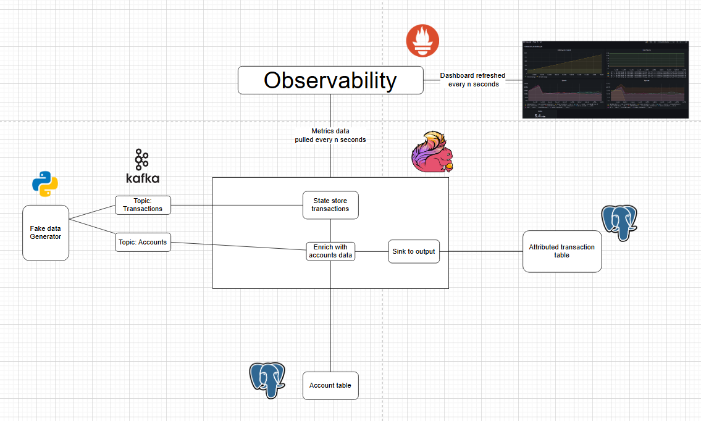
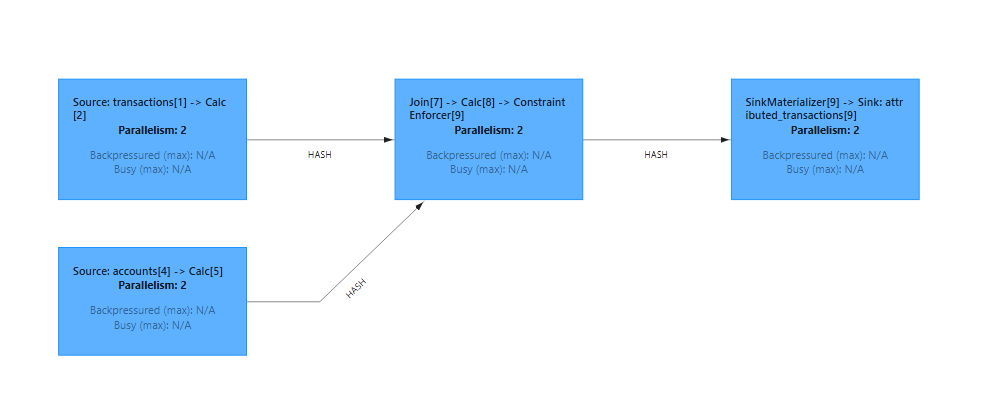

* [Calculate Risk Transaction Streaming Pipeline Project](#calculate-risk-transaction-streaming-pipeline-project)
   * [Project](#project)
   * [Run on codespaces](#run-on-codespaces)
   * [Run locally](#run-locally)
      * [Prerequisites](#prerequisites)
   * [Architecture](#architecture)
   * [Code design](#code-design)
   * [Run streaming job](#run-streaming-job)
   * [Check output](#check-output)
   * [Tear down](#tear-down)
   * [Contributing](#contributing)
   * [References](#references)

# Calculate Risk Transaction Streaming Pipeline Project

## Project

Imagine we operate a banking system and need to assess risk for our credit operations. Each day, new accounts are created, and transactions occur even more frequently. We aim to build a system that identifies risk in every transaction.

Our objectives are:

1. Enhance transaction data by integrating it with account details, sourced from transactional databases for both accounts and transactions.
2. Evaluate the risk associated with each transaction.
3. Record the attributed transactions in a table for logging and analysis.

## Run on codespaces

You can run this data pipeline using GitHub codespaces. Follow the instructions below.

1. Create codespaces by going to the **[riskpipe_project](https://github.com/HuyPham235711/riskpipe_project)** repository, cloning(or fork) it and then clicking on `Create codespaces on main` button.
2. Wait for codespaces to start, then in the terminal type `make run`.
3. Wait for `make run` to complete.
4. Go to the `ports` tab and click on the link exposing port `8081` to access Flink UI and clicking on `Jobs -> Running Jobs -> checkout-attribution-job` to see our running job..

**Note** Make sure to switch off codespaces instance, you only have limited free usage; see docs [here](https://github.com/features/codespaces#pricing).

## Run locally

### Prerequisites

To run the code, you'll need the following:

1. [git](https://git-scm.com/book/en/v2/Getting-Started-Installing-Git)
2. [Docker](https://docs.docker.com/engine/install/) with at least 4GB of RAM and [Docker Compose](https://docs.docker.com/compose/install/) v1.27.0 or later
3. [psql](https://blog.timescale.com/tutorials/how-to-install-psql-on-mac-ubuntu-debian-windows/)

If you are using windows please setup WSL and a local Ubuntu Virtual machine following **[the instructions here](https://ubuntu.com/tutorials/install-ubuntu-on-wsl2-on-windows-10#1-overview)**. Install the above prerequisites on your ubuntu terminal, if you have trouble installing docker follow **[the steps here](https://www.digitalocean.com/community/tutorials/how-to-install-and-use-docker-on-ubuntu-22-04#step-1-installing-docker)**.

## Architecture

Our streaming pipeline architecture is as follows (from left to right):

1. **`Application`**: The bank generates accounts and transactions data.
2. **`Queue`**: The accounts and transactions data are sent to their corresponding Kafka topics.
3. **`Stream processing`**: 
   1. Flink reads data from the Kafka topics.
   2. The transaction data is stored in our cluster state
   3. The transaction data is enriched with account information by querying the account table in Postgres.
   4. The transaction data is left joined with the account data( in the cluster state).
5. The enriched and attributed transaction data is logged into a Postgres sink table.
4. **`Monitoring & Alerting`**: Apache Flink metrics are pulled by Prometheus and visualized using Graphana.



## Code design

We use Apache Table API to 

1. Define Source systems: **[accounts, transactions](#)**. [This python script](#) generates fake account and transaction data.
2. Define how to process the data (enrich and attribute): **[Enriching with account data and attributing transactions ](#)**
3. Define Sink system: **[sink](#)**

The function **[run_transaction_attribution_job](#)** creates the sources, and sink and runs the data processing.

We store the SQL DDL and DML in the folders `source`, `process`, and `sink` corresponding to the above steps. We use [Jinja2](https://jinja.palletsprojects.com/en/3.1.x/) to replace placeholders with [config values](#). **The code is available [here](https://github.com/HuyPham235711/riskpipe_project).**

## Run streaming job

Clone and run the streaming job (via terminal) as shown below:

```bash
git clone https://github.com/HuyPham235711/riskpipe_project
cd riskpipe_project
make run # restart all containers, & start streaming job
```

1. **Apache Flink UI**: Open [http://localhost:8081/](http://localhost:8081/) or run `make ui` and click on `Jobs -> Running Jobs -> transaction-attribution-job` to see our running job. 
2. **Graphana**: Visualize system metrics with Graphana, use the `make open` command or go to [http://localhost:3000](http://localhost:3000) via your browser (username: `admin`, password:`flink`).

**Note**: transaction [Makefile](#) to see how/what commands are run. Use `make down` to spin down the containers.

## Check output

Once we start the job, it will run asynchronously. We can check the Flink UI ([http://localhost:8081/](http://localhost:8081/) or `make ui`) and clicking on `Jobs -> Running Jobs -> transaction-attribution-job` to see our running job.



We can check the output of our job, by looking at the attributed transactions. 

Open a postgres terminal as shown below.

```bash
pgcli -h localhost -p 5433 -U postgres -d postgres 
# password: postgres
```

Use the below query to check that the output updates every few seconds.

```sql
SELECT transaction_id, account_id, account_name, amount, risk_score FROM banking.attributed_transactions ORDER BY datetime_occured desc limit 5;
```

## Tear down 

Use `make down` to spin down the containers.

## Contributing

Contributions are welcome. If you would like to contribute you can help by opening a Github issue or putting up a PR.

## References

1. [Apache Flink docs](https://nightlies.apache.org/flink/flink-docs-release-1.17/)
2. [Flink Prometheus example project](https://github.com/mbode/flink-prometheus-example)
